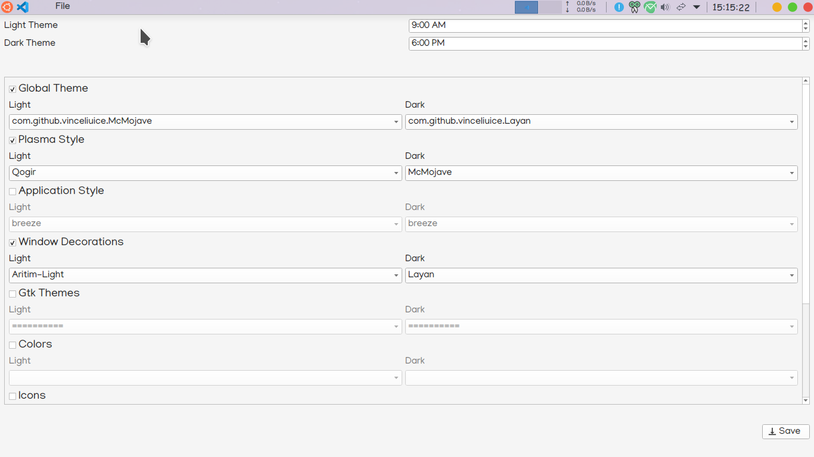

# KDE AutomaticThemeSwitcher

## Description(Ver 0.2)
AutoThemeSwitcher is a Bash script,that works with user provided details.              
A UI based on python is used to take Configuration for different settings.           
Uses Native KDE commands for bash execution.       

## Configuration
Run `sh ./install.sh` in terminal from current directory,to start script execution.    
A python Virtual environment is created and necessary tools are downloaded,then a UI is provided to select options.        
select the options you would like to change then click on save to start the theme script.       

On specified time KDE will switch from provided light theme details to dark theme and vice versa.      

The default time to switch to Light theme is 9 AM,Dark Theme is 6 PM.         
change the times,if needed.      

*UI*        

* open settings app and follow along for better understanding of theme/icons names.    
   
*Light Theme*           
    

*Dark Theme*            
       

My Configuration Files:          
If you like my configuration/setup the files are available [here](./backUpFiles/config.tar.gz)     

## Requirements
1. **KDE Plasma 5.18+**
2. **Python 3.8+**
3. **pyqt5**
4. **pyqt5-tools**

### Tested On
1. **Ubuntu 20.04 LTS**
2. **KDE Plasma 5.18.5**
3. **Qt Version 5.12.8**
4. **Python 3.8.2**

### Additional Information
A python UI is provided to take options for categories as input,then store them in a file and are used with a bash script.      
A virtual environment is created on Script execution,related files are downloaded,then Current desktop theme details are fetched,to display to user.     
When user clicks save we store the data and create a cronjob.        

a log for theme is generated everytime a script is executed to debug any errors.    
In home directory a folder with name **~/.kdeAutoThemeSwitch** will be created,to store      
1. logs
2. theme switch script
3. user provided data                   
This directory is used to change themes from light to dark and vice versa.    

**Supported theme options**         
* Global Theme
* Plasma Style
* Application Style
* Colors
* Icons
* Window Decorations
* Cursors
* Splash Screen
* Kvantum(if available)
* GTK Theme

**Files edited on theme change**       
* plasmarc
* kdeglobals
* kwinrc
* kcminputrc
* ksplashrc
* gtk-3.0/settings.ini
* kvantum.kvconfig(if installed)

Cursor for Desktop Environmnet
* located in `~/.icons/cursor-name` and `/usr/share/icons/`
* change from terminal `kwriteconfig5 --file ~/.config/kcminputrc --group Mouse --key cursorTheme cursor-value`

## plasmoids(widgets/applets)
the user installed widgets for small tasks/trigger relaying on big things.like weather,calendar
* located in `~/.local/share/plasma/plasmoids/` and `/usr/share/plasma/plasmoids/`