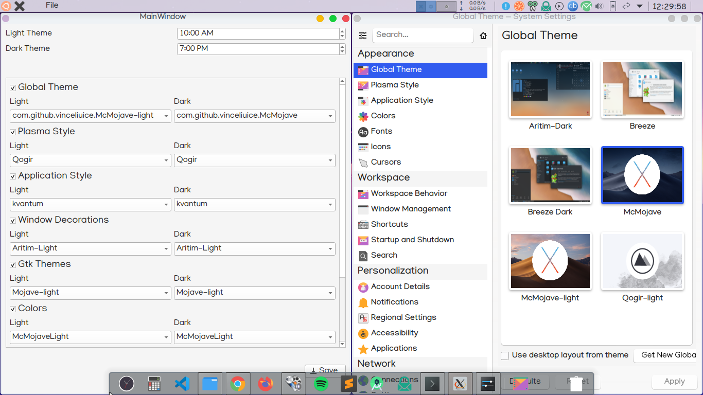
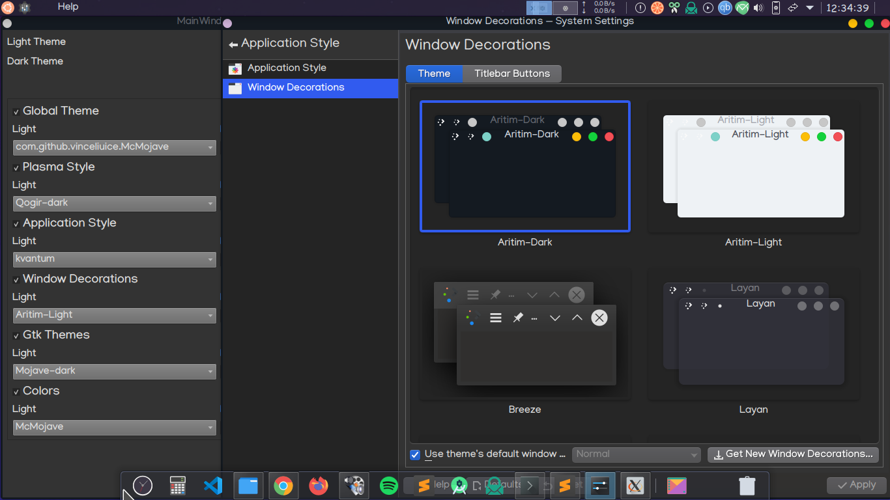

# KDE AutomaticThemeSwitcher

## Description(Ver 1.0)
AutoThemeSwitcher is a Bash script,that works with user provided details.              
A UI based on python is used to take Configuration for different System settings.           
Uses Native KDE commands for bash execution.       

## Configuration
Clone/Download the project,Open a terminal in project folder            
Run         
`sh ./install.sh`           
in terminal to start script execution.    

1. A python Virtual environment is created and necessary tools are downloaded.     
2. A UI is provided to select options.        
3. Select the options you would like to change automatically then click on save
4. On specified time KDE will switch from light theme details to dark theme and vice versa.      
5. The default time to switch to Light theme is 9 AM,Dark Theme is 6 PM.         
   * change the times,if needed.(works for hours only)      

>open settings app and follow along for better understanding of theme/settings names.      
   
*Light Theme*           
    

*Dark Theme*            
       

My Configuration Files:          
If you like my configuration(or)desktop setup,the files are available [here](./backUpFiles/config.tar.gz)     

## Requirements
1. *KDE Plasma 5.18+*
2. *Python 3.8+*
3. *pyqt5*
4. *pyqt5-tools*

### Tested On
1. *Ubuntu 20.04 LTS*
2. *KDE Plasma 5.18.5*
3. *Qt Version 5.12.8*
4. *Python 3.8.2*

### Additional Information
A virtual environment is created on Script(install.sh) execution,related files are downloaded.      
A python UI is provided to take options for categories as input.        

Current desktop theme details are fetched,to display to user.     
When user clicks save,selected options are stored in a file and a cronjob is created.        

a log for theme is generated everytime a script is executed to debug any errors.    
In home directory a folder with name **~/.kdeAutoThemeSwitch** is created,to store      
1. logs
2. theme switch script
3. user provided configuration data                   
This directory is used to change themes from light to dark and vice versa.    

**Supported theme options**         
* Global Theme
* Plasma Style
* Application Style
* Window Decorations
* GTK Theme
* Colors
* Icons
* Kvantum(if available)

**Files edited on theme change**       
* plasmarc
* kdeglobals
* kwinrc
* gtk-3.0/settings.ini
* kvantum.kvconfig(if installed)

